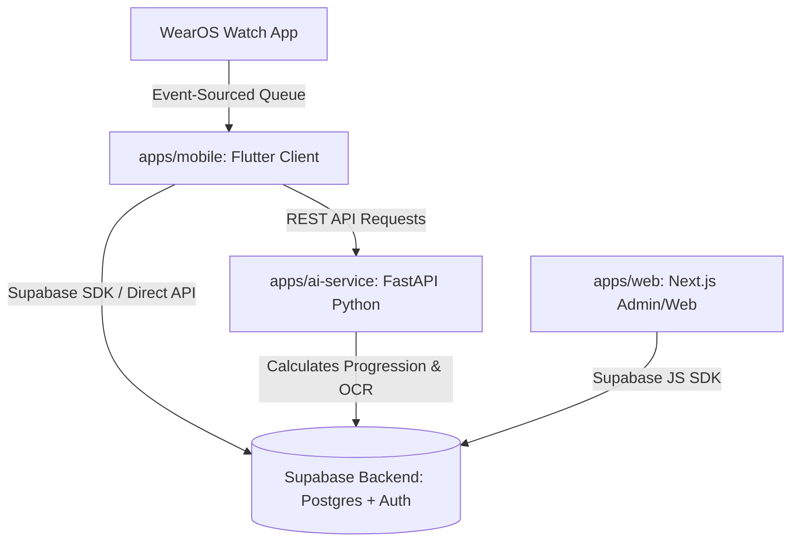
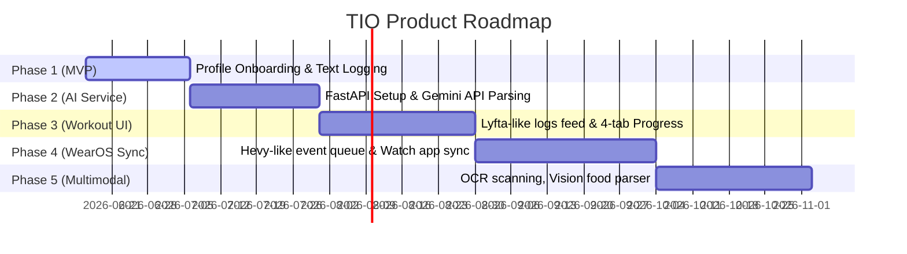

# TIO Unified Future Plan: Hevy, Lyfta, Reshape & GymLevels Integration

TIO (Tnyx) is an Adaptive Health Operating System designed to integrate nutrition, training, recovery, smartwatch synchronization, strength standards, and active AI coaching into a single, cohesive experience. 

This document outlines the **Future Roadmap** to merge the core strengths of **Hevy**, **Lyfta**, **Reshape**, and **GymLevels** into the **TIO Monorepo** (`G:\Tio`).

---

## 📐 Overall System Topology

The TIO Monorepo is structured as a **Turborepo** workspace with three core applications communicating with a hardened database backend:

---

## 🛠️ Feature Integration Map (The Hybrid Strategy)

To create a state-of-the-art health application, TIO combines features from all three reference systems while prioritizing **Privacy-First (No social feeds, likes, or comments)**.

### 1. Lyfta-Inspired Workout & Progress UX
* **Workout Tab Feed**: Replaces a generic home page with a detailed, private workout history feed (inspired by Lyfta's post-workout card). Each card displays:
  * Workout duration and total volume.
  * Exercises list with sets, reps, and weights.
  * Dynamic muscle map thumbnails illustrating targeted muscles.
* **4-Tab Progress Overview**: The Progress screen is organized into 4 inner tabs (which we initialized in Flutter):
  1. **Overview**: Displaying active streaks, workout count, training volumes, active hours, and historical trends.
  2. **Weight**: Dynamic line charts plotting weight variations, target lines, and logs.
  3. **Measures**: Manual metrics tracking for chest, biceps, waist, etc.
  4. **Photos**: A visual grid of progress media for before/after comparisons.

### 2. Hevy-Inspired Smartwatch Sync (Event Sourcing)
To prevent data loss and support workout logging directly on the wrist (WearOS companion):
* **Event-Sourced Queue**: The smartwatch doesn't write directly to standard tables. It stores a list of sequential actions (`WorkoutStarted`, `SetCompleted`, `TimerPaused`, `WorkoutEnded`) in a local offline buffer.
* **Reconciliation Sync API**: Once reconnected to the mobile app, the queue is posted to the backend to recreate the exact workout session history sequentially, resolving conflicts if the user edited sets on their phone.
* **Standalone Watch Auth**: Authentication token handshake via QR code or numeric code generated on the mobile app.

### 3. Reshape-Inspired Nutrition & AI Coach
* **Multimodal Food Logging**: Fast logging using text, voice notes, or photo uploads. The FastAPI backend analyzes inputs using the **Gemini Vision/LLM API** to parse ingredients, quantities, and macros.
* **Proactive Daily AI Feedback**: At the end of the day, the AI compares user macronutrient and micronutrient consumption against target profiles and prompts advice (e.g., *"You're short on protein and zinc today. Add pumpkin seeds or chicken to your dinner."*).
* **Real-time AI Coach (Xio)**: Active guidance during workouts:
  * **Set Logging Listener**: When a set is logged in Flutter, local engine checks targets.
  * **Tuning Rest Timers**: Suggests extending rest timers if RPE was high (near failure).
  * **Weight Progression Logic**: Automatically advises adding weight for the next set if reps exceeded target ranges.

### 4. GymLevels-Inspired Strength Standards & Gamification
* **265 Standard Exercises Catalog**: Integration of the complete exercise library containing instruction steps, tips, primary/secondary muscles, breathing techniques, splits, and metabolic equivalents (MET) for calorie burn calculation.
* **Strength Ranks (untrained to legend)**: Calculates user's strength levels by comparing bodyweight to 1-Rep Max (1RM) for key lifts (Bench Press, Squat, Deadlift, Overhead Press) and maps them to ranks: Untrained, Bronze, Silver, Gold, Platinum, Diamond, Master, Legend.
* **Athlete Class Profiles**: Dynamic profiling based on user's workout focus (Athlete Elite, Balance Warrior, Endurance Hunter, Mass Builder, Recovery Specialist, Strength Seeker).
* **Gamified Badges & Achievements**: Visual rewards mapped in the UI (PR Hunter, Consistency, Volume, Strength, Muscle Master, Explorer, Milestone) to motivate user progression.

---

## 📊 Database Schema Blueprint (Supabase Tables)

To support this unified future scope, the Postgres schema in Supabase will be mapped as follows:

| Table Name | Description | Features Served |
| :--- | :--- | :--- |
| `profiles` | Basic user details (Age, Height, Units, target weight) | Onboarding & calculations |
| `user_workout_profiles` | Preferences, target splits, and workout frequency | Plan generation & Progression |
| `user_nutrition_profiles` | Dynamic TDEE targets, macros (Carbs/Protein/Fat), allergies | AI Nutrition Engine |
| `workout_sessions` | Header of executed workouts (Duration, date, template) | Workout Feed & Progress Overview |
| `workout_exercises` | Logs of exercises completed inside a session (Volume, RPE) | Workout Feed & Volume trends |
| `exercise_definitions` | Global catalog of 265 standard exercises (instruction arrays, MET values, difficulty, splits) | Exercise catalog & calorie burn calculations |
| `food_logs` | Logs of meals, calorie metrics, and raw logs text | Nutrition Feed & AI Feedback |
| `ai_conversations` | Conversation threads history between user and AI coach | AI Coach context memory |
| `user_strength_ranks` | Stores calculated strength ratios and current rank badges | Strength ranking & progression display |
| `user_achievements` | Log of unlocked user badges and performance milestones | Gamification & Badges |

---

## 📈 Phased Execution & Delivery Roadmap

### 🟢 Phase 1: MVP (Profile Onboarding & Text Logging) [Active]
* **Target**: Sync raw user metadata and text-only daily logs to Supabase database.
* **Status**: Layout theme fixes, theme managers, welcome screens, and basic router integrations are in place.

### 🟡 Phase 2: AI Parsing & Basic Recommendations
* **Target**: Extract structure from raw text logs using FastAPI.
* **Execution**: 
  1. Build Python FastAPI service routes for `/api/v1/nutrition/parse`.
  2. Map Gemini APIs to parse logs into Carbs, Protein, Fats, Calories.
  3. Update Flutter UI to display active progress rings on the Dashboard.

### 🟡 Phase 3: Workout Logging & Core Routines (Lyfta & GymLevels Integration)
* **Target**: Implement full workout execution flow, detailed progress overview tab, and exercise database.
* **Execution**:
  1. Setup Supabase tables for `workout_sessions`, `workout_exercises`, and populate `exercise_definitions` with the 265 GymLevels exercises database.
  2. Implement Lyfta-style workout logs layout on the Workout Screen.
  3. Feed real volume database telemetry, weight metrics, strength ranks (Bronze to Legend), and badges to the 4-tab Progress Overview (Overview, Weight, Measures, Photos).

### 🟡 Phase 4: Smartwatch Sync (Hevy Integration)
* **Target**: Event-sourced sync queue between WearOS and Mobile App.
* **Execution**:
  1. Build Event-sourced sync controllers in backend/FastAPI.
  2. Setup standalone offline logging inside the WearOS app (`apps/android/watch`).
  3. Test conflict reconciliation algorithms for offline/online sync.

### 🟡 Phase 5: Multimodal & Realtime Coaching (Reshape AI Integration)
* **Target**: Advanced Vision logs and set-by-set TTS audio workout coach.
* **Execution**:
  1. Connect Gemini Multimodal Vision APIs to scan plate photos.
  2. Write local Text-to-Speech parser rules to trigger dynamic advice alerts (Xio AI Coach) on sets performance.
