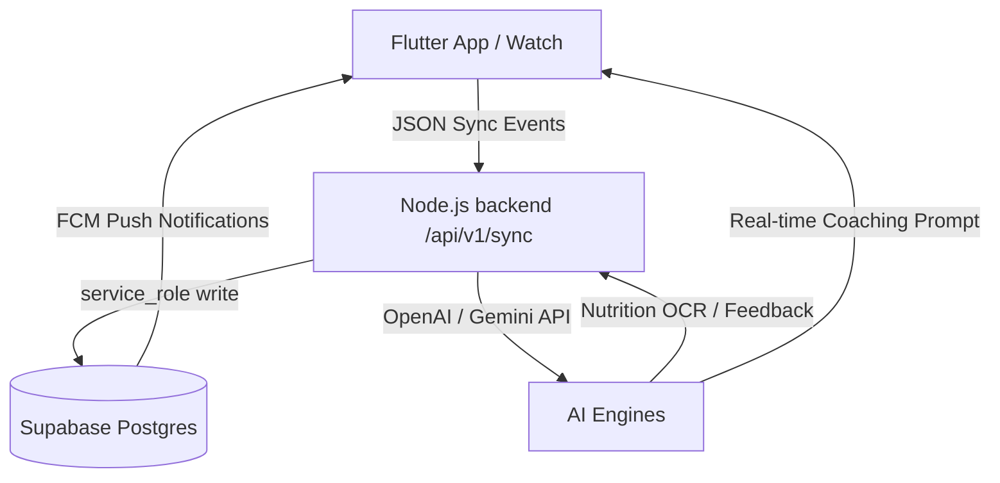
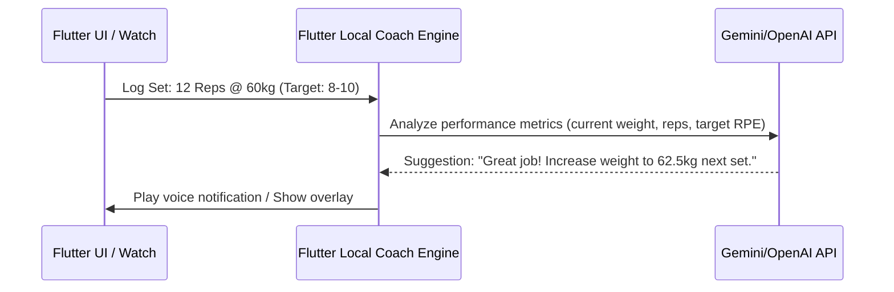

# Tnyx Unified Health App: Product Architecture & AI Blueprint

This document defines the implementation roadmap and system architecture for the unified **Tnyx Health App** (incorporating features from Reshape, Lyfta, and Hevy) with advanced Add-ons like **Real-time AI Workout Coaching** and **AI Log Feedback**.

---

## 📐 Overall System Architecture

The project is structured as a Monorepo:
* **Frontend:** Flutter App ([apps/flutter](file:///G:/Tnyx-hub/apps/flutter)) targeting Android, iOS, Web, and WearOS.
* **Backend:** TypeScript Node.js/Express Server ([backend/](file:///G:/Tnyx-hub/backend)) orchestrating business logic and external integrations.
* **Database:** Supabase PostgreSQL Database ([database/](file:///G:/Tnyx-hub/database)) managing schemas, storage buckets, and server-side RPC functions.

---

## 🛠️ Feature Mapping & Technical Implementation

### 1. Workout Tracker (Lyfta & Reshape Hybrid)
* **Design Pattern:** A clean, constraint-driven workout builder showing muscle maps and exercise lists.
* **DB Tables:** Uses `workout_sessions` and `workout_exercises`.
* **State Management:** Flutter Riverpod/BLoC managing active workouts. During a workout, it calculates Volume, 1RM, and Rest Timers natively on the device.

### 2. Smartwatch Integration (Hevy-like WearOS)
To sync workouts between Mobile and WearOS standalone modes without data loss:
* **Event-Sourced Ingestion:** Instead of simple CRUD, the watch app appends events (e.g. `set_completed`, `workout_started`) to a local ledger.
* **Sync API Endpoint:** The Flutter app calls `/api/v1/sync/workout` to upload the queue of `WorkoutEvent`s, which the backend aggregates into the primary database.
* **Wear OS Auth:** Standalone watch connection uses long-lived encrypted tokens issued via `/api/v1/auth/wear`.

---

## 🎨 Customized UI & Navigation Strategy (Tnyx App UX)

To build a clean, distraction-free environment, Tnyx deviates from Lyfta's social model in several ways:

### 1. 100% Private Data (No Friends / No Community)
* **No Social Feed:** Unlike Lyfta, there is no shared community page or friend feed showing other users' lifts.
* **No Interactions:** Because the app is strictly private to the user, there are no "Like" or "Comment" buttons anywhere on the log cards.

### 2. Workout Tab (Modified Home Feed)
* **Lyfta's Home Feed Layout:** Lyfta's feed cards structure (workout logs, exercises list, set details, duration, volume, and muscle map thumbnails) is highly detailed and adopted here.
* **Tnyx Workout Tab:** This feed layout is moved into the **Workout Tab** and serves as the user's personal workout history log list.

### 3. Progress Tab (Overview Panel)
* **Anatomy of Progress:** The **Progress Tab** incorporates Lyfta's comprehensive Progress Overview metrics, including:
  * Workout volume analytics graphs.
  * Body measurement progress charts.
  * Streak calendars and activity density maps.

---

## 🚀 Advanced AI Add-ons (Design & Setup)

### 3. Real-Time AI Workout Coach
Instead of just static tracking, an AI Coach (**Xio**) assists the user dynamically during active lifts.

#### How it works:
* **Set-by-Set Analysis:** When a user logs a set (e.g. Bench Press: 10 reps at 60kg), the app checks if they hit the target range.
* **Dynamic Rest Adjustments:** If a set was too hard or near failure, the AI adjusts the rest timer (e.g., increasing from 2 mins to 3 mins) and speaks/shows a voice prompt: *"Good effort. Rest 3 minutes. Keep the same weight."*
* **Weight Progression Engine:** If the user logs reps easily exceeding the target, the AI dynamically suggests a weight increase for the next set: *"That set was light. Let's add 2.5 kg for the next set."*

---

### 4. Nutrition Engine & AI Log Feedback
Integrates a Reshape-like food logger with automated, proactive feedback loops.

#### Multi-modal Logging (Text, Voice, Photo)
* **Text/Voice:** Backend controller (/api/v1/images) runs OCR on plates/labels.
* **AI Prompts:** Uses `nutrition_prompt` and `nutrition_vision_prompt` templates to extract ingredient lists, quantities, and macronutrients strictly in JSON formats.

#### Post-Log AI Feedback Loop
* **Trigger:** When a user completes their logging for a meal or the entire day, the app calls the backend service.
* **Analysis:** The `MicronutrientEngine` and `MetabolicEngine` compare the logged totals against the user's daily goals (`targetCalories`, `targetProtein`, etc.).
* **Proactive Advice:** Fio/Xio triggers a push notification or home feed card containing highly actionable advice (e.g. *“You are low on zinc and protein today. Consider adding pumpkin seeds or chicken to your dinner.”*).

---

## 📊 Technical DB Configuration (Supabase Schema Mapping)

To support these extensions, the tables are defined in Supabase as follows:

| Table Name | Schema Purpose | AI Use Case |
| :--- | :--- | :--- |
| **`users`** | Core profiles, units, and registration statuses. | User profile metadata context. |
| **`user_nutrition_profiles`** | Targets (calories, macros, dietary restrictions). | AI target validation & advice calculation. |
| **`user_workout_profiles`** | Experience, schedule, and goals. | Plan generation customization constraints. |
| **`workout_sessions`** | Executed logs (reps, sets, weights, duration). | Input data for real-time coach set updates. |
| **`food_logs`** | Meal times, calories, and macronutrient breakdowns. | Micronutrient calculation and macro feedback. |
| **`ai_conversations`** | Context logs between Fio/Xio and the user. | Chat interface state backup. |
| **`ai_usage_logs`** | Limits and API request token metrics. | Dynamic API rate-limiting guardrail. |

---

## 📈 Implementation Steps

### Phase 1: Local DB & Sync
1. Wire up Health Connect and WearOS sync packages inside [apps/flutter](file:///G:/Tnyx-hub/apps/flutter).
2. Configure Event-Sourced ledgers in backend services.

### Phase 2: Live AI Feedback
1. Wire `MicronutrientEngine` to the food log timelines in the backend.
2. Setup daily scheduler jobs (using Redis queue) to send push notifications with macro/micro insights.

### Phase 3: Real-Time Audio Coach
1. Implement local Text-to-Speech (TTS) logic in Flutter.
2. Build local set-evaluator rules to trigger prompts immediately after logging a set.
